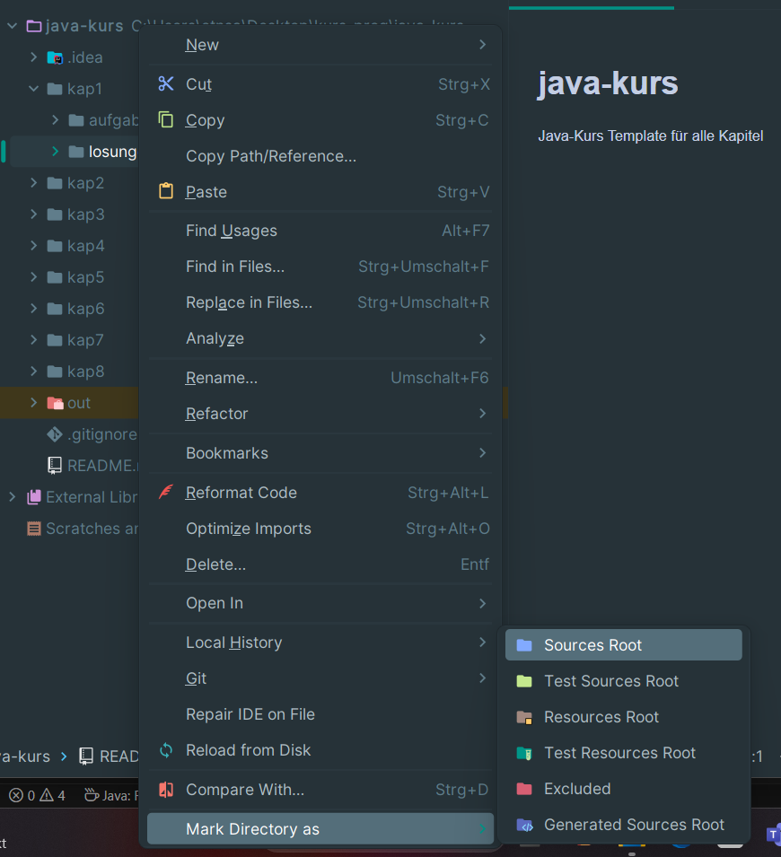

# 🧮 Aufgabe 1A.1 – Volumen eines Quaders berechnen

## 📝 Aufgabenstellung

Schreibe ein Java-Programm, das das **Volumen eines Quaders** berechnet. Ein Quader ist ein dreidimensionaler Körper mit rechteckigen Flächen. Das Volumen wird berechnet mit der Formel:

`Volumen = a × b × c`

Dabei sind: (Benutze Gleitkommazahlen!)
- `a`: Länge der ersten Kante (in cm) 
- `b`: Länge der zweiten Kante (in cm)
- `c`: Länge der dritten Kante (in cm)

## 🎯 Ziel

Das Programm soll:
1. Den Benutzer freundlich begrüßen.
2. Die drei Kantenlängen `a`, `b` und `c` nacheinander vom Benutzer abfragen.
3. Das Volumen berechnen.
4. Das Ergebnis übersichtlich auf dem Bildschirm anzeigen.

## 💡 Hinweise

- Denke daran, die Eingaben in Gleitkommazahlen umzuwandeln.
- Verwende sinnvolle Variablennamen und eine saubere Formatierung.
- Achte auf eine gute Benutzerführung (z.B. mit erklärenden Ausgaben in der Konsole).

## 📁 Abgabe

- Erstelle im Verzeichnis **`losungen`** einen eigenen Ordner mit deinem **Vor- und Nachnamen** (z.B. `losungen/AnnaMusterfrau/src`).
- Lege darin deine Lösung als Java-Datei ab, z.B. `Aufgabe_1A_1.java`.
- Achte darauf, dass dein Code **fehlerfrei kompiliert** und läuft.
- Kommentare im Code sind ausdrücklich erwünscht!
- Schreibe deinen Namen und das Datum der Abgabe in deiner Java-Datei.
- Orientiere dich bei der Erstellung des Ordners an **`losungen/maxmustermann/src`**.
---

Viel Erfolg beim Programmieren! 💻✨